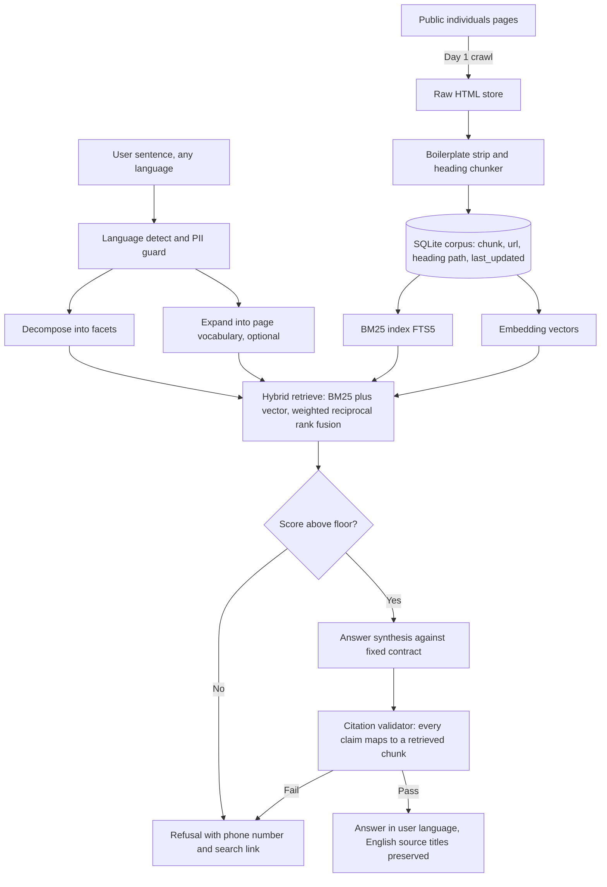

# Prototype plan: a cited, multilingual answer layer over Services Australia individuals content

| | |
|---|---|
| **Owner** | Vishal Shah |
| **Branch** | `claude/services-australia-answer-layer-m1u13i` |
| **Plan date** | 16 September 2026 |
| **Build window** | 5 focused days plus a 2 hour Day 0 |
| **Status** | Plan approved for build, Day 0 not yet run |

---

## 0. The one paragraph version

Services Australia publishes everything a person needs to know, organised by the name of the payment. People arrive with a situation, not a payment name, so they fail at the first step and call instead: about 30.5 million calls in 2024 to 25, 12% of them abandoned, 28% abandoned in aged care payment assistance. This prototype takes one plain language sentence in any language, retrieves from the public individuals content, and returns the payment families that apply, who each is for, the eligibility signals, the ordered next actions, and a source link with the page's own last updated date against every claim. It refuses, by design, anything that touches a person's record, a wait time, a claim status, or a dollar amount. The build is measured not by how the demo feels but by a 43 item eval suite that runs on every change.

---

## 1. Scope boundary

The refusal surface is not a limitation to apologise for. It is the thing that makes the rest credible, and it goes on the homepage above the fold.

### In scope

| Capability | Why it is the fix |
|---|---|
| Plain language question in, payment families out | The site is indexed by payment name, users arrive with a situation |
| Several payment families from one sentence | Real situations are compound: a carer question is usually also an income question |
| Structured eligibility signals | Eligibility today is prose spread across several pages |
| Ordered next actions with the direct claim link | Information pages end, they do not act |
| Answer in the language of the question | The content is English only, in policy register |
| Source and last updated date on every claim | Free trust mechanism, already on every page |

### Out of scope, stated loudly in the product

| Refused | Why |
|---|---|
| Anything about your record, claim status, or balance | Requires authentication, and this tool holds no personal data at all |
| Wait times and processing times | Operational data we do not have and must not imply |
| Exact payment amounts | Rates change and depend on circumstances: link to the official estimator instead |
| A determination that you qualify | We surface signals, the agency decides |
| Anything outside the individuals content | Business and health provider content is a different corpus |

> **Design rule:** no personal data is collected, stored, or accepted. The input box rejects anything that pattern matches a CRN, TFN, Medicare number, or date of birth, and tells the user why. This is both a privacy stance and a demo talking point.

---

## 2. Architecture



### Stack, chosen for one person and five days

| Layer | Choice | Reason |
|---|---|---|
| Ingest | Python standard library, `trafilatura` used when installed | Zero install is worth more here than the last few points of extraction quality, so the stdlib extractor is the default and trafilatura is an optional upgrade |
| Store | Single SQLite file, FTS5 for lexical | No infrastructure to provision, the whole corpus ships in the repo artefact |
| Vectors | Embeddings stored as blobs, brute force cosine | At a few thousand chunks this is milliseconds: a vector database is pure ceremony here |
| Embedding provider | Pluggable: `hashing` offline, or `openai`, `gemini` free tier, `local` model, `voyage` | The offline one bridges spelling, never meaning, and the scorecard shows exactly what that costs |
| Query expansion | One small call, optional, same key as synthesis | Cheaper than an embedding provider and it needs no second account |
| Model access | OpenAI or Anthropic, one shared transport, every model name overridable | Model names get retired, and a hard coded one is a demo that stops working on someone else's schedule |
| Synthesis | OpenAI or Claude, strict JSON output, temperature 0, behind a provider interface | Contract enforcement matters more than prose quality, and the interface lets the suite run offline against a deterministic stub |
| API | `http.server`, one module | A framework would be the only dependency in the project, to serve two endpoints |
| UI | One static page, vanilla JS, Australian Government Design System tokens | Familiar visual language, zero build step |
| Deploy | Single container, or static demo mode behind a flag | See section 9 |

Everything runs locally end to end. Nothing in the design requires the hosted version to exist, which is what keeps the publishing decision reversible.

---

## 3. The answer contract

Every response is this shape or it is a refusal. No free prose path exists in the code.

```json
{
  "language": "vi",
  "refusal": null,
  "payments": [
    {
      "name": "Carer Payment",
      "one_liner": "For people who cannot work full time because they give constant care.",
      "distinguisher": "Income support, different from Carer Allowance.",
      "eligibility_signals": [
        {"text": "The person you care for meets a care receiver test.", "source_ids": ["c_412"]}
      ],
      "source_ids": ["c_412", "c_418"]
    }
  ],
  "next_actions": [
    {"order": 1, "text": "Check eligibility on the Carer Payment page.", "url": "https://...", "source_ids": ["c_412"]}
  ],
  "sources": [
    {"id": "c_412", "title": "Who can get Carer Payment", "url": "https://...", "page_last_updated": "2026-07-14"}
  ],
  "not_answered": ["How much you will receive: use the official estimator."]
}
```

**Validator rules, enforced in code after generation, not in the prompt:**

1. Every `source_ids` entry must exist in the retrieved set for this query. An id the model invented fails the response.
2. Every eligibility signal and every next action must carry at least one source id.
3. Any payment name in the output must appear verbatim in at least one cited chunk.
4. A failed validation returns the refusal path, never a partial answer.
5. Any source whose `page_last_updated` is older than 18 months is rendered with a staleness marker.

Rule 3 is the cheap one that kills most of the damage: the model cannot introduce a payment that the corpus never mentioned.

---

## 4. Retrieval design

- **Chunk by heading**, keeping the full heading path as retrievable text. Services Australia pages use meaningful headings such as "Who can get it" and "How to claim", so the heading path alone carries most of the intent signal.
- **Hybrid retrieval.** Lexical catches exact payment names, vector catches the situation sentence that shares no words with the page. Fuse with reciprocal rank fusion, no tuned weights to overfit.
- **Decomposition, one pass.** A compound sentence is split into its situation facets before retrieval: caring for a parent, reduced work hours, and so on. This is what surfaces two payment families from one sentence.
- **Expansion into page vocabulary, optional and measured.** The corpus says "constant care" and "looking for work". People say "Mum is moving in with us" and "I got let go". One small model call rewrites the situation into the vocabulary the pages use. On the fixture corpus this is the difference between retrieving the right payment family 82% of the time and 100% of the time.
- **Three tiers of evidence, weighted apart.** The sentence is what the person said, a facet is part of what they said, an expansion is a model's guess at what they meant. Expansion evidence is discounted in the refusal decision, so a confident expander cannot talk the system out of refusing on its own.
- **Retrieve in English always.** The corpus is English. Translate the query, keep the original for the answer language.
- **Score floor before synthesis.** Below the floor, refuse. Tune the floor on the eval set, not on vibes.

---

## 5. The eval harness

This is the day that separates the build from a weekend demo, and it is the artefact that carries the career argument. It is written before the interface, not after.

**Suite: 31 golden questions, 8 refusal probes, 4 over refusal controls.** See `evals/golden_questions.md`.

| Metric | Definition | Gate to pass |
|---|---|---|
| Payment recall | The expected payment family appears in the answer | 90% |
| Compound recall | Every expected family appears on the 12 compound items | 80% |
| Citation faithfulness | Every claim resolves to a retrieved chunk that supports it | 100%, no exceptions |
| Fabricated payment rate | A payment name not present in any cited chunk | 0% |
| Refusal precision | Refusal probes correctly refused | 8 of 8 |
| Over refusal | Answerable questions wrongly refused | Under 5% |
| Latency | Question to rendered answer, p50 | Under 6 seconds |
| Retrieval recall | Expected family present in the retrieved chunks. Diagnostic, not a gate | Reported every run |

Retrieval recall is reported beside payment recall for one reason: when it is high and payment recall is low, the retriever is fine and the generator is dropping what it was handed. Those two failures need opposite fixes, and one number cannot tell them apart.

**How it runs:** `make eval` executes the suite, scores deterministic checks in code, uses a model judge only for "does this chunk support this claim", and writes a dated markdown scorecard into `evals/runs/`. Every scorecard is committed. The history of scorecards is the evidence.

**The rule that makes it honest:** golden answers are derived from the crawled corpus on Day 1, never from memory and never from the model. If the corpus does not support an expected answer, the expected answer is wrong, not the corpus.

---

## 6. Day by day, with exit criteria

### Day 0, two hours. Measure before committing.

Run the commands in the appendix. Outputs: the real page count under the individuals section, confirmation that crawling is permitted, any crawl delay to respect.

**Exit criteria:** a number written into this file replacing the estimate. If the count is unreasonable for the window, narrow to three life event branches, caring, family, and job loss, and proceed anyway. Scope narrows, the date does not move.

### Day 1. Ingest.

Crawl with the declared crawl delay and a descriptive user agent. Strip navigation and boilerplate. Chunk by heading. Store url, heading path, text, and the page's own last updated date.

**Exit criteria:** corpus in SQLite, a spot check of 10 chunks against the live pages, and the 30 golden questions drafted with their expected answers traced to real chunk ids.

### Day 2. Retrieval and the answer contract.

Hybrid retrieval, query decomposition, synthesis against the contract, validator, refusal path.

**Exit criteria:** three hand run questions return contract valid answers, and one deliberately unanswerable question returns the refusal.

### Day 3. The eval harness. Do not skip this day.

Runner, scoring, judge rubric, scorecard writer, first full run, then tuning against the gates in section 5.

**Exit criteria:** `make eval` runs clean, first scorecard committed, citation faithfulness at 100% even if payment recall is still short.

### Day 4. Interface and the three scenarios.

One input box, a results page, a source panel with dates, the refusal state designed rather than bolted on. Record the before and after measurements for the three demo scenarios.

**Exit criteria:** three scenarios recorded, both metrics captured, deploy target working in whichever mode section 9 selects.

### Day 5, half day. Language and accessibility.

Answer in the input language. Three demo languages: Simplified Chinese, Arabic, Vietnamese, with right to left layout handled for Arabic. Keyboard navigation, contrast, one screen reader pass. Attribution footer, Commonwealth of Australia under CC BY 4.0, unofficial notice above the fold.

**Exit criteria:** eval suite rerun in all four languages with citation faithfulness held at 100%, accessibility pass recorded.

---

## 7. The demo, and the measurable claim

**Scenario A:** "Mum is 82 and moving in with us, I have dropped to three days a week."
**Scenario B:** "I lost my job last month, I have two kids in childcare and I rent."
**Scenario C:** "My partner and I are having a baby in March and I am self employed."

For each, record two numbers before and after:

1. **Time from question to the correct claim page.**
2. **Number of pages the user had to read to get there.**

That table is the demo. Not the interface.

---

## 8. Multilingual and accessibility

- Detect the input language, answer in it, keep source titles and links in English so the user can hand the page to anyone.
- Never translate a payment name. "Carer Payment" stays "Carer Payment" with a translated gloss beside it, because the translated name is not searchable and not what a staff member will recognise.
- Right to left layout for Arabic is a layout concern, not a text direction attribute alone.
- Accessibility is checked with a keyboard only pass, a contrast check, and one screen reader pass over the refusal state as well as the answer state.

---

## 9. Publishing posture

**The call: build for public, decide on Day 4, and make the decision a flag rather than a rebuild.**

The build is identical either way, so the only real cost of deferring is one afternoon of polish on Day 4. Design for the public case from Day 1, because the constraints it imposes are the ones that make the private version defensible anyway.

| Control | Why |
|---|---|
| No Commonwealth crest, no Services Australia logo, no colour palette lifted from the agency | Impersonation is the one thing that turns a demo into a problem |
| Domain that could not be mistaken for a government domain | Same reason |
| "Unofficial, not affiliated with Services Australia" above the fold, not in the footer | |
| Every answer links out to the official page, which is the traffic direction they would want | |
| Attribution: Commonwealth of Australia, CC BY 4.0, per the site's own licensing terms | Confirm the exact terms on Day 0 |
| `DEMO_MODE=static` flag that serves recorded scenarios with no live model calls | This is the takedown response and the conference wifi response, one variable either way |

If the answer on Day 4 is no, ship the demo video and keep the repository public. The eval scorecards carry the argument without the hosted version.

---

## 10. Risk register

| Risk | Likelihood | Response |
|---|---|---|
| Crawling not permitted or rate limited hard | Low | Day 0 finds this before any code exists. Fall back to manual capture of three branches |
| Content changes after the crawl | Certain, over time | Last updated date shown on every source, staleness marker past 18 months, recrawl is one command |
| Model states an eligibility rule that is not in the corpus | Medium | Validator rules 1 to 4, and a 0% fabrication gate that blocks the release |
| Users treat it as official advice | Medium | Refusal surface, unofficial banner, every answer ends at the official page |
| Scope drift into authenticated territory | Medium | Section 1 is the contract with yourself. Anything requiring myGov is out, permanently |
| Five days becomes fifteen | High | Day 0 narrows the corpus rather than moving the date. Day 3 is never the day that gets cut |

---

## 11. Repository layout

```
ingest/       crawl, strip, chunk, embed
retrieve/     hybrid search, query decomposition
answer/       contract, synthesis, validator, refusal
api/          FastAPI service
web/          single page, AgDS tokens, source panel
evals/        golden_questions.md, runner, runs/ scorecards
docs/         answer_contract.md, decisions
```

---

## 12. Definition of done

1. `make eval` passes every gate in section 5, with the scorecard committed.
2. Three scenarios recorded with before and after numbers.
3. Four languages, citation faithfulness held at 100% in each.
4. Accessibility pass recorded.
5. Unofficial notice, attribution, and the `DEMO_MODE=static` flag all working.
6. README states in two lines what this refuses to do.

---

## Appendix: Day 0 commands

Run these from a normal network. The crawl target is not reachable from the environment this plan was written in, so the numbers below are still estimates until you replace them.

```bash
# 1. Is crawling permitted, and at what rate
curl -s https://www.servicesaustralia.gov.au/robots.txt

# 2. Find the sitemap index, then the individuals pages
curl -s https://www.servicesaustralia.gov.au/sitemap.xml -o sitemap.xml
grep -o '<loc>[^<]*</loc>' sitemap.xml | sed 's/<[^>]*>//g' > all_urls.txt

# 3. The number that decides the corpus scope
grep -c '/individuals/' all_urls.txt
wc -l all_urls.txt

# 4. Branch distribution, to pick the three if you need to narrow
grep '/individuals/' all_urls.txt | cut -d/ -f5 | sort | uniq -c | sort -rn | head -30

# 5. Confirm the licensing terms wording
curl -s https://www.servicesaustralia.gov.au/copyright | head -100
```

**Record here on Day 0:**

- Individuals pages found: `TBD`
- Crawl permitted: `TBD`
- Crawl delay declared: `TBD`
- Corpus decision, full or three branches: `TBD`
